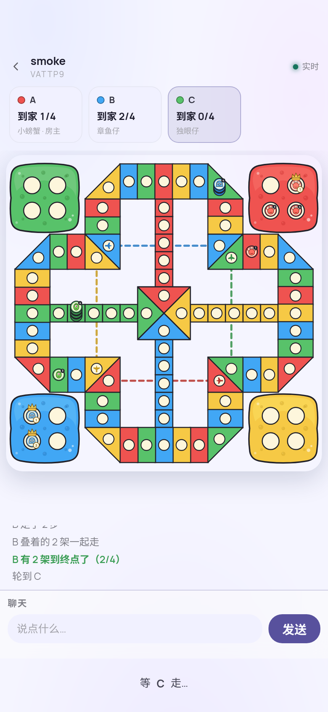

# 飞行棋 · Aeroplane Chess

**规则设计 Mikann · 棋盘 Damien · 程序 澄（Cheng）**
*Rules by Mikann · Board art by Damien · Code by Cheng*

一个自托管的网页飞行棋：一个 Node 进程、一个端口、没有数据库。
房主输密码开房，把邀请链接发给朋友，四家同桌；手机上也能打。
规则不是标准飞行棋，是 Mikann 自己定的那套（一小门六正门、本色跳四、飞机场直飞十二、叠机一摞走、到家要精确），细则见 [docs/RULES.md](docs/RULES.md)。

A self-hosted aeroplane chess (飞行棋 / Ludo-family) for the browser: one Node process, one port, no database.
The host logs in with a password, opens a room, shares an invite link; up to four players, phone-friendly.
The rules are Mikann's own house rules, not the standard ones — see [docs/RULES.md](docs/RULES.md).



## 跑起来 · Run

```bash
git clone https://github.com/mikann05013-dev/aeroplane-chess.git
cd aeroplane-chess
npm install
BISCA_PASSWORD=你的密码 PORT=8082 HOST=0.0.0.0 npm start
```

打开 `http://<你的地址>:8082/aeroplane/`，输密码进大厅，开房，把「邀请链接」发给朋友。

| 环境变量 | 作用 | 默认 |
| --- | --- | --- |
| `BISCA_PASSWORD` | 房主密码。**不设＝开放模式**，能连到端口的人都是房主，只适合内网 | 空 |
| `PORT` / `HOST` | 监听端口 / 地址 | `8082` / `127.0.0.1` |
| `BISCA_DATA_DIR` | 房间档和配置存哪 | `./data` |
| `BISCA_THEME_DIR` / `BISCA_FONT_DIR` | 主题与字体目录（一般不用管） | `./vendor/...` |

首次启动会在 `data/config.json` 里生成 cookie 密钥；把 `allow_guests` 设成 `true` 才允许没登录的朋友凭邀请链接进房（示例见 `data/config.example.json`）。
放在反向代理后面时按路径 `/aeroplane/` 分流即可，静态资源两种挂法都接。

## 怎么玩 · Play

- 房主：登录 → 大厅「开一间房」→ 坐下选颜色 → 把邀请链接发给朋友 → 人齐了「开局」。
- 朋友：点邀请链接 → 起名、选颜色、坐下。不需要账号。
- 轮到你：掷骰 → 点一架能动的飞机。规则引擎会算好哪几架能走。
- 大厅里左滑房间可以删除；已结束 / 暂停 / 进行中三种状态一眼能看。

## 接口 · API

所有接口在 `/aeroplane/api/` 下，JSON 进出。房主凭登录 cookie，朋友凭 `?invite=<token>`，落座后的动作凭自己的 `playerToken`。

| 方法 | 路径 | 说明 |
| --- | --- | --- |
| POST | `/api/login` | `{password}` → 房主 cookie |
| POST | `/api/rooms` | 开房 `{name}` → `{code, inviteToken}` |
| GET | `/api/rooms` | 大厅（房主） |
| POST | `/api/rooms/:code/join` | 坐下 `{name, color}` → `{playerToken}`（带旧 token 回来＝复座） |
| POST | `/api/rooms/:code/start` | 开局（房主） |
| GET | `/api/rooms/:code/state?token=` | 当前局面 |
| GET | `/api/rooms/:code/events` | 长轮询：局面变化 / 聊天 |
| POST | `/api/rooms/:code/action` | `{playerToken, type: "roll"}` 或 `{playerToken, type: "move", plane: 0..3}` |
| POST | `/api/rooms/:code/chat` | 桌上说话 |
| POST | `/api/rooms/:code/pause` · `/close` · `/skip` · `/revoke_invite` | 暂停 / 收摊（`purge:true` 才删档）/ 替挂机者掷骰 / 换邀请码 |

接口形状足够简单，AI 玩家或脚本可以直接照着 curl 上桌。

## 自检 · Test

```bash
npm test
```

400 局随机对局，盯着规则不变量（位置合法、同格不共存、撞子必回库、名次齐全），有一条不对就红。

## 署名与许可 · Credits & License

- 规则设计 **Mikann**，棋盘与角色绘制 **Damien**，程序 **澄（Cheng）**。
- 底盘来自 [29-Cu/bisca](https://github.com/29-Cu/bisca)（Cu & Lunedì），开房 / 邀请 / 大厅的做法照它的形状来；带走并改动的文件列在 [NOTICE.md](NOTICE.md)。
- 整体许可 [CC BY 4.0](LICENSE)：随便用、随便改，署名留着就行。字体按 SIL OFL 1.1（`vendor/fonts/README.md`）。
